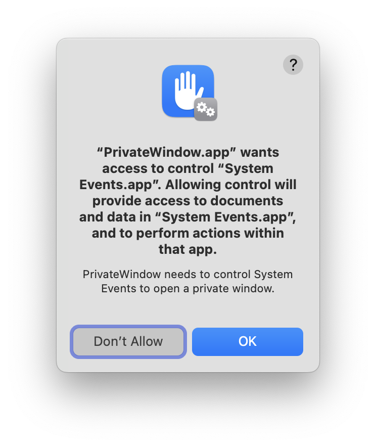

# PrivateWindow

PrivateWindow is an app for macOS 12 Monterey or later that opens URLs in a Safari or Safari Technology Preview private window and then quits.

PublicWindow is an app for macOS 12 Monterey or later that opens URLs in a Safari or Safari Technology Preview non-private window and then quits.

These apps can be used independently, but they were designed to be used with [Link Unshortener](https://underpassapp.com/LinkUnshortener/) and [StopTheMadness](https://underpassapp.com/StopTheMadness/).

Donations of app icons are welcome!

PrivateWindow was originally based on [Safari Private](https://github.com/sindresorhus/Safari-Private), with some improvements. PrivateWindow and PublicWindow can be used with Safari or Safari Technology Preview, they respect opening URLs in the background, and PublicWindow can open non-private windows rather than private windows.

## Installing

1. Download the [latest release](https://github.com/lapcat/PrivateWindow/releases/latest).
2. Move `PrivateWindow.app` to your Applications folder.
3. Open `PrivateWindow.app`.
4. Press the Open Accessibility Settings button.

5. Press the Open System Settings button.
6. Enable PrivateWindow.

7. Repeat the above steps for `PublicWindow.app`.
8. The first time you open a URL with the app, allow it to control Safari and System Events.





## Uninstalling

1. Move `PrivateWindow.app` and `PublicWindow.app` to the Trash.

## Building

Building from source requires Xcode 14 or later.

Before building, you need to create a file named `DEVELOPMENT_TEAM.xcconfig` in the project folder (the same folder as `Shared.xcconfig`). This file is excluded from version control by the project's `.gitignore` file, and it's not referenced in the Xcode project either. The file specifies the build setting for your Development Team, which is needed by Xcode to code sign the app. The entire contents of the file should be of the following format:
```
DEVELOPMENT_TEAM = [Your TeamID]
```

## Author

[Jeff Johnson](https://lapcatsoftware.com/)

To support the author, you can [PayPal.Me](https://www.paypal.me/JeffJohnsonWI) or buy [my App Store apps](https://underpassapp.com/).

## Copyright

PrivateWindow and PublicWindow Copyright © 2023 Jeff Johnson. All rights reserved.

## License

See the [LICENSE.txt](LICENSE.txt) file for details.
